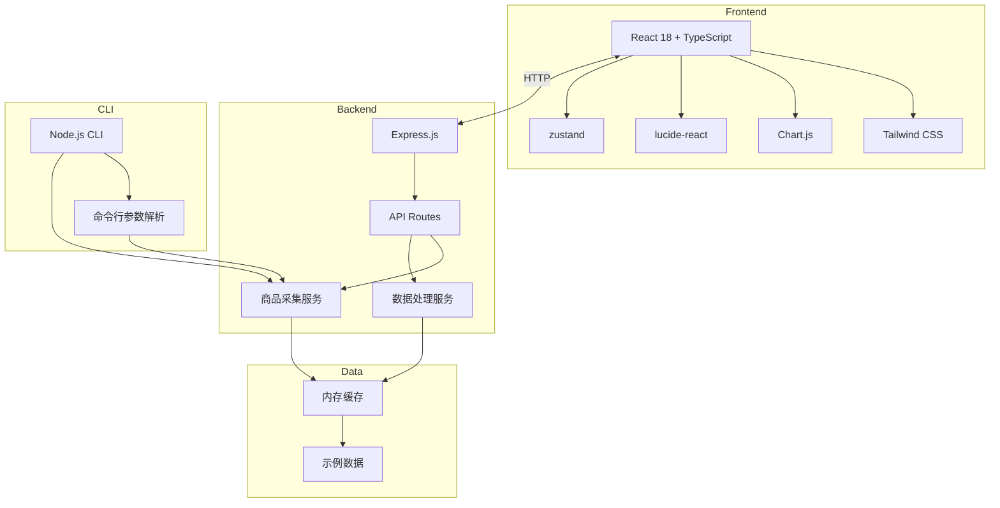
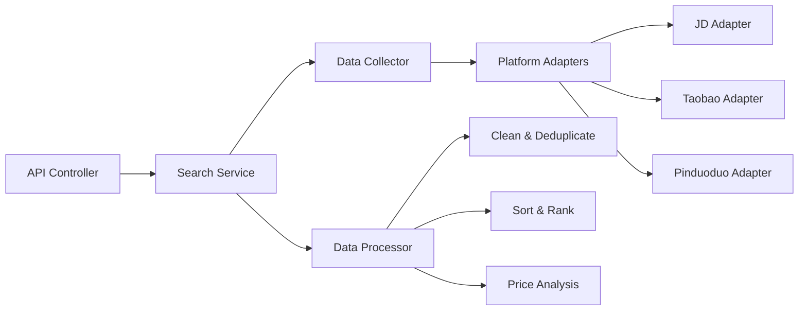
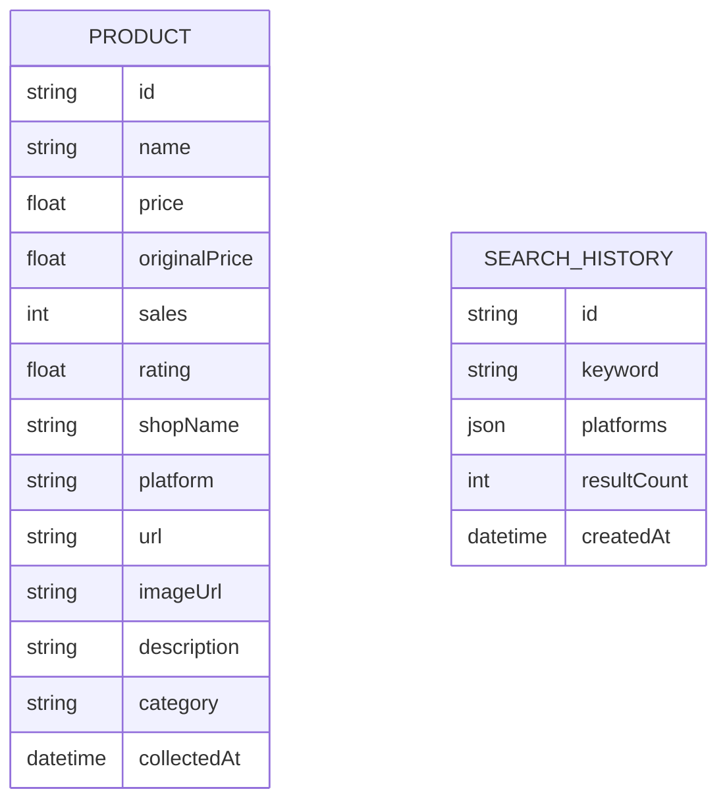

## 1. Architecture Design


## 2. Technology Description
- **前端**: React@18 + TypeScript + tailwindcss@3 + vite + Chart.js + lucide-react + zustand
- **后端**: Express.js@4
- **命令行工具**: Node.js + commander
- **数据处理**: 纯 JavaScript/TypeScript 实现
- **初始化工具**: vite-init

## 3. Route Definitions
| Route | Purpose |
|-------|---------|
| / | 首页 - 搜索入口和示例数据 |
| /results | 搜索结果页 - 商品列表和图表 |
| /compare | 商品对比页 - 横向对比和推荐 |
| /api/search | API - 搜索商品 |
| /api/sample | API - 获取示例数据 |

## 4. API Definitions

### 4.1 Types
```typescript
interface Product {
  id: string;
  name: string;
  price: number;
  originalPrice?: number;
  sales: number;
  rating: number;
  shopName: string;
  platform: 'jd' | 'taobao' | 'pinduoduo';
  url: string;
  imageUrl?: string;
  description?: string;
  category?: string;
  collectedAt: Date;
}

interface SearchParams {
  keyword: string;
  platforms?: ('jd' | 'taobao' | 'pinduoduo')[];
  limit?: number;
}

interface SearchResponse {
  success: boolean;
  data: Product[];
  total: number;
  message?: string;
}
```

### 4.2 API Endpoints
- `GET /api/sample`: 获取示例数据
  - Response: `SearchResponse`
  
- `POST /api/search`: 搜索商品
  - Body: `SearchParams`
  - Response: `SearchResponse`

## 5. Server Architecture Diagram


## 6. Data Model

### 6.1 Data Model Definition


### 6.2 数据处理逻辑
1. **数据采集**: 模拟各平台API，生成结构化商品数据
2. **数据清洗**: 
   - 去除重复商品（基于名称相似度）
   - 过滤无效价格（<=0）
   - 标准化数据格式
3. **排序**: 
   - 按价格升序/降序
   - 按销量降序
   - 按评分降序
4. **性价比计算**: 
   - 综合考虑价格、销量、评分
   - 使用加权评分算法
