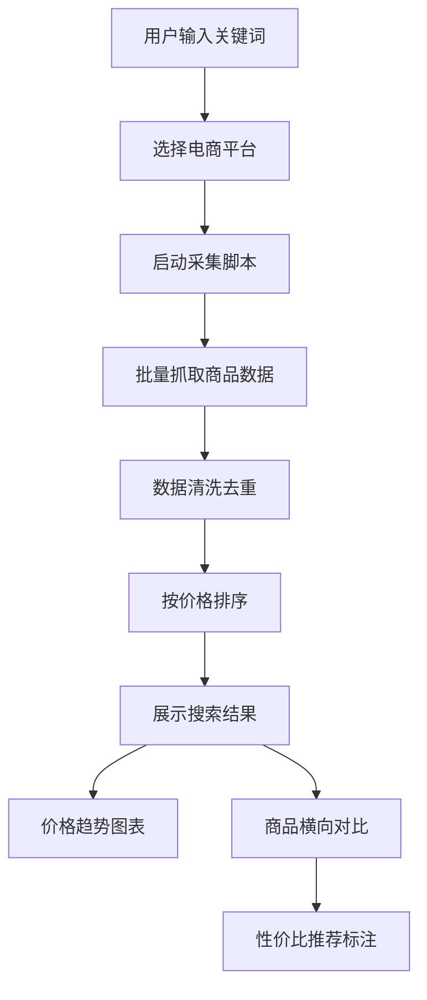

## 1. Product Overview
电商商品价格自动化采集与对比工具，帮助用户快速获取多平台商品信息并进行智能比价。
- 解决跨平台价格比较繁琐的问题，提供批量搜索、数据清洗、排序和可视化功能
- 目标用户为电商消费者、价格敏感型用户和商品研究者

## 2. Core Features

### 2.1 User Roles
| Role | Registration Method | Core Permissions |
|------|---------------------|------------------|
| Normal User | 无需注册 | 使用所有功能，包括搜索、查看、导出数据 |

### 2.2 Feature Module
1. **主页**：搜索入口、示例数据展示、快速操作
2. **搜索结果页**：商品列表、筛选排序、价格图表
3. **商品对比页**：多商品横向对比、性价比推荐

### 2.3 Page Details
| Page Name | Module Name | Feature description |
|-----------|-------------|---------------------|
| 主页 | 搜索栏 | 输入关键词，选择平台，一键搜索 |
| 主页 | 示例数据 | 预加载商品示例，展示完整功能 |
| 搜索结果页 | 商品列表 | 展示商品名称、价格、销量、评分等信息 |
| 搜索结果页 | 数据清洗 | 自动去重、过滤无效数据 |
| 搜索结果页 | 排序筛选 | 按价格、销量、评分排序 |
| 搜索结果页 | 价格图表 | 价格分布、趋势可视化 |
| 商品对比页 | 横向对比 | 多商品参数对比表格 |
| 商品对比页 | 性价比推荐 | 智能标注性价比高的商品 |

## 3. Core Process
用户在搜索栏输入关键词 → 选择平台 → 系统批量采集商品数据 → 自动清洗去重 → 按价格排序 → 展示搜索结果和图表 → 可选进行多商品横向对比 → 获得性价比推荐

## 4. User Interface Design

### 4.1 Design Style
- **主色调**：科技蓝 (#2563EB) + 渐变绿色 (#10B981)
- **按钮风格**：圆角矩形，带轻微阴影，hover时有缩放效果
- **字体**：Inter 作为主要字体，搭配 JetBrains Mono 用于代码/数据展示
- **布局风格**：卡片式布局，清晰的视觉层级
- **图标风格**：使用 lucide-react 线性图标，简洁现代

### 4.2 Page Design Overview
| Page Name | Module Name | UI Elements |
|-----------|-------------|-------------|
| 主页 | 搜索栏 | 居中布局，渐变背景，大输入框，带平台选择下拉框 |
| 主页 | 示例数据 | 卡片网格，悬停效果，一键加载功能 |
| 搜索结果页 | 商品列表 | 响应式卡片，价格高亮，平台标识 |
| 搜索结果页 | 价格图表 | Chart.js 绘制，响应式设计 |
| 商品对比页 | 对比表格 | 固定表头，横向滚动，高亮推荐 |

### 4.3 Responsiveness
- Desktop-first 设计，自适应平板和移动设备
- 使用 Tailwind CSS 响应式断点
- 移动端优化：单列布局，简化控件，触摸友好

### 4.4 数据可视化
- 使用 Chart.js 库
- 价格分布柱状图
- 价格趋势折线图
- 平台占比饼图
